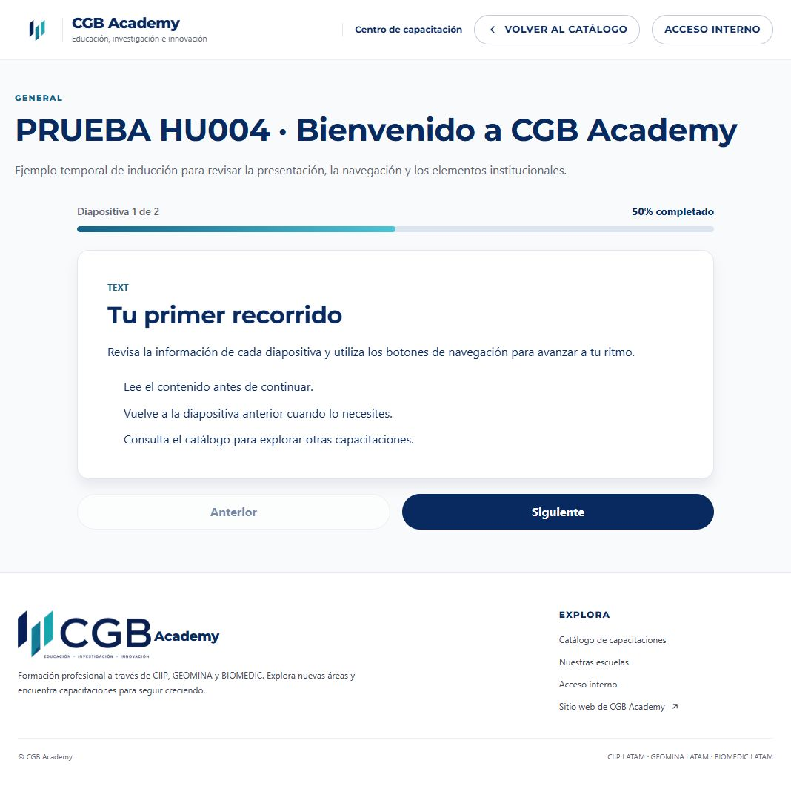
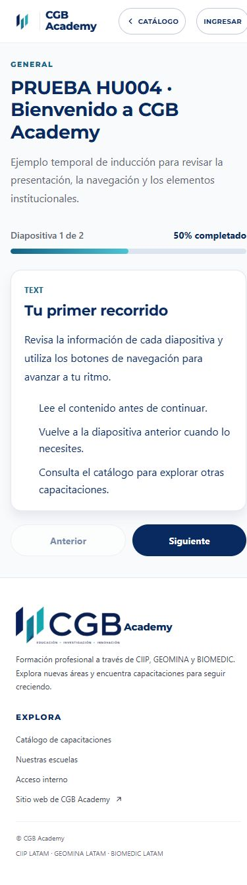
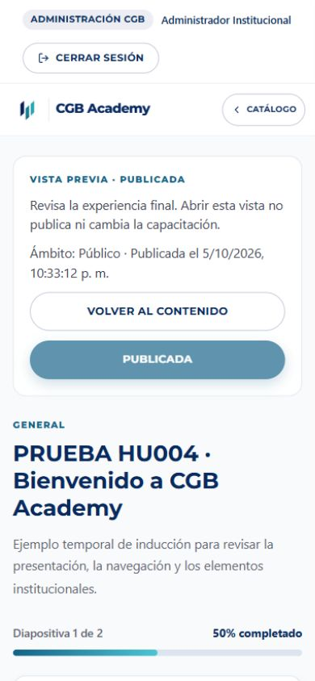

# HU004 — Acabado visual

Revisión completada el 6 de octubre de 2026 (Lima), para CGB-16 / Alex Carpio. Entrega en el [PR #5](https://github.com/milith0kun/proyecto-ing-software/pull/5).

## Cambios

- Vista previa y capacitación pública comparten `MarcoCapacitacion`, con cabecera institucional, regreso al catálogo y pie de página. El contenido sigue usando el mismo visor; los controles de publicación aparecen únicamente en la vista previa protegida.
- La vista previa mantiene un solo botón de cierre de sesión, en la barra administrativa.
- Se ajustaron títulos, espacios, botones y diálogo de confirmación para celular. El diálogo permite desplazamiento si supera la altura disponible.
- Se mantuvo la identidad visual y los archivos originales del logo. Se quitó el filtro que volvía blanco el logo sobre el fondo blanco del pie y se ajustó su tamaño. Esta corrección afecta todos los lugares que reutilizan `PieCgb`.
- El visor vacío y la página de capacitación no disponible tienen una presentación consistente; esta última conserva navegación y regreso al catálogo.

## Comprobación

La versión final del código aprobó las 67 pruebas existentes, ESLint y compilación Next.js/TypeScript. La revisión visual cubrió escritorio y celular de 390 × 844. En vista previa móvil se midieron 375 px de ancho de documento y 375 px de contenido: sin desbordamiento horizontal. Se comprobó una cabecera institucional y un pie, con el logo sin filtro. No se afirma una revisión exhaustiva de todos los dispositivos o del resto del sistema.

Para las capturas se utilizó una cuarta capacitación temporal, titulada `PRUEBA HU004 · Bienvenido a CGB Academy`, con dos diapositivas ficticias. Se eliminó exclusivamente ese ID después de comprobar título; la consulta final confirmó cero capacitaciones y cero diapositivas asociadas. Se cerró la sesión de esta revisión y se restauró el tamaño del navegador. Los tres registros de las pruebas funcionales anteriores también habían sido eliminados.

## Evidencia

## Entrega

Los criterios funcionales y sus 26 comprobaciones con persistencia real están documentados en [HU004-ACEPTACION-ATLAS.md](HU004-ACEPTACION-ATLAS.md). Continúan pendientes la aprobación de un compañero y la integración en `desarrollo`. La historia permanece en Revisión.
