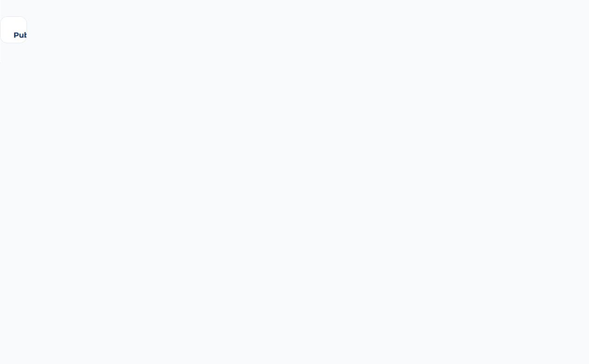
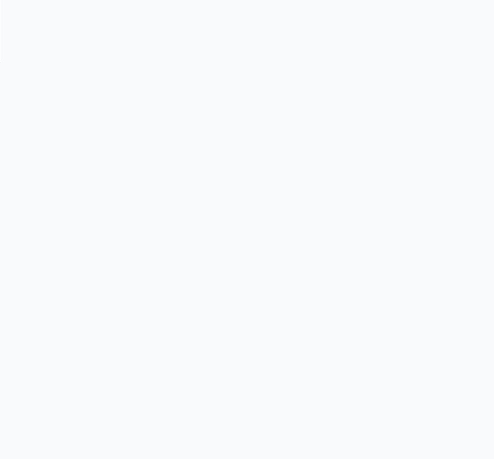
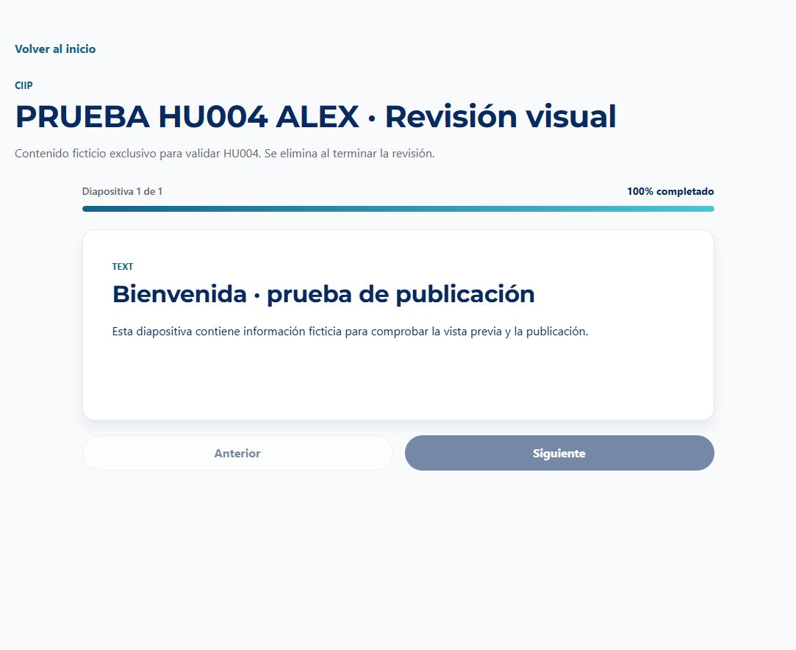

# HU004 — Aceptación con MongoDB Atlas e interfaz real

Fecha: 5 de octubre de 2026, Lima. Responsable: Alex Carpio. Historia: CGB-16. PR: https://github.com/milith0kun/proyecto-ing-software/pull/5

## Resultado

Los cuatro criterios de HU004 se verificaron sobre la aplicación local compilada y la base Atlas compartida del proyecto, con autorización explícita de Alex. Se utilizaron las cuentas de prueba existentes; no se ejecutó el seed ni se cambiaron usuarios o contraseñas. La primera ejecución usó endpoints reales y Prisma sin dobles: 26 comprobaciones correctas, incluyendo limpieza. La segunda recorrió los formularios y botones del navegador.

| Escenario BDD | Verificación real |
|---|---|
| CA01: Dado un borrador con slides, cuando se abre Vista previa, entonces se presenta el contenido sin alterar BD | La página protegida respondió 200 con título y slide guardados. Antes/después en Atlas: mismo estado, fecha y updatedAt. Vista previa y visor público renderizan el mismo componente y SlideViewer. |
| CA02: Dado al menos un slide completo, cuando se publica, entonces cambia a PUBLICADA y registra fecha | POST respondió 200; consulta directa de Atlas confirmó estado y fecha. También se publicó desde el diálogo real; fecha persistida 2026-10-06T03:22:26.058Z, correspondiente al 5 de octubre en Lima. Repetir POST conserva la fecha. |
| CA03: Dado un borrador vacío, cuando se intenta publicar, entonces se rechaza con el mensaje indicado | POST y PUT respondieron 400. Estado BORRADOR y fecha nula conservados en Atlas. La interfaz mostró exactamente «Debe agregar al menos una diapositiva antes de publicar». |
| CA04: Dado contenido PUBLICO/PUBLICADA, cuando se consulta sin login, entonces aparece en el catálogo y abre su visor | Catálogo anónimo incluyó el ID de prueba y visor público respondió 200. Tras cambiar sólo ese registro a INTERNO, quedó fuera del catálogo y el visor público respondió 404. El navegador abrió la capacitación pública después de cerrar sesión. |

Comprobaciones adicionales: creación conserva BORRADOR aunque se solicite PUBLICADA; publicación anónima rechazada con 401; Colaborador rechazado con 403; borrador fuera del catálogo; guardado real de dos slides; cambio de ámbito conserva estado y fecha.

## Índice de catálogo

La inspección inicial detectó únicamente `_id_` en `capacitaciones`. Se añadió un índice no único específico para el filtro y orden existentes:

`capacitaciones_catalogo_publico`: `{ ambito: 1, estado: 1, createdAt: -1 }`.

El esquema Prisma ahora declara ese índice con el mismo nombre. Se creó exclusivamente con `createIndexes`, sin `db push`, sin eliminar índices y sin alterar documentos. `listIndexes` confirmó los campos; `explain` con hint confirmó que la consulta puede ejecutarse con ese índice. No se hicieron mediciones de rendimiento ni se afirma que el planificador lo elija para todo tamaño de colección.

## Evidencia visual

Las capturas corresponden a datos ficticios guardados temporalmente en Atlas, no a una página de demostración separada.

## Limpieza y límites

Se crearon dos capacitaciones identificadas como PRUEBA HU004 ALEX. Se eliminaron exclusivamente esos registros después de comprobar ID y título. Las consultas finales confirmaron ausencia de esas capacitaciones y de sus slides. Se cerraron las sesiones utilizadas. La única modificación permanente en Atlas es el índice de catálogo.

La colección ya contiene publicaciones antiguas sin diapositivas. No se cambiaron esos registros ni se aplicó una migración sobre el contenido del equipo. El nuevo flujo impide publicar nuevos borradores vacíos. La corrección de contenido antiguo requiere coordinación con sus responsables.

La prueba de UI real usó una diapositiva; la navegación de varias diapositivas e interacción está cubierta por la suite automatizada y la revisión visual anterior. No se validó edición simultánea por varios administradores ni el despliegue remoto. La clave fija de respaldo de HU001 continúa como observación separada.

## Validación final y entrega

- 67 pruebas automatizadas aprobadas.
- ESLint sin advertencias.
- Compilación Next.js y TypeScript correctos tras declarar el índice.
- Criterios CA01–CA04 comprobados en la aplicación local con persistencia real.
- Pendiente de DoD: revisión por un compañero e integración en desarrollo. La implementación queda lista para revisión; no se declara aprobada por pares ni integrada.
