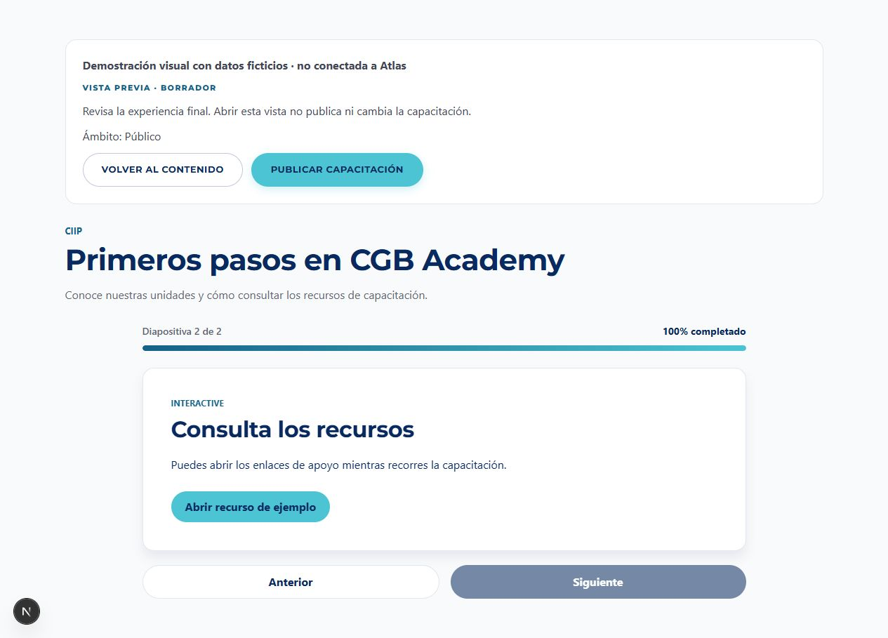
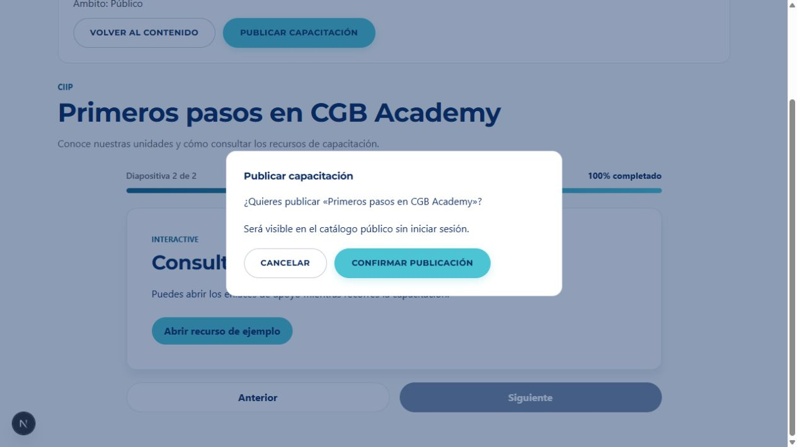

# HU004 — Previsualizar y publicar una capacitación (CGB-16)

Responsable: Alex Carpio. Implementación del 5 de octubre de 2026 sobre `desarrollo` c9bad09, propuesta desde `alex-carpio`.

Estado actualizado: los criterios se comprobaron con MongoDB Atlas y desde el navegador el 5 de octubre (Lima). Véase [aceptación real y capturas](HU004-ACEPTACION-ATLAS.md). Pendientes: revisión por un compañero e integración en desarrollo.

## Problema y resultado

La base del equipo ya tenía editor de diapositivas y visor público. Su vista de edición tenía una presentación diferente al recorrido final, el estado podía cambiarse a PUBLICADA sin verificar contenido y no se registraba fecha de publicación.

Esta entrega añade una vista previa protegida para Administrador, enlazada desde la biblioteca y el editor. La vista previa y la página pública utilizan `ExperienciaCapacitacion` y el mismo `SlideViewer` de HU006; abrir o recorrer la vista no cambia estado. La columna del editor se identifica como diapositiva seleccionada para distinguirla del recorrido completo.

La publicación se confirma en un diálogo que muestra su ámbito. POST `/api/capacitaciones/[id]/publicar` comprueba permisos, ID y contenido, y cambia estado/fecha en una transacción Prisma. El PUT existente conserva compatibilidad y aplica las mismas reglas de contenido y fecha, evitando que se omita la validación mediante otro endpoint. Crear una capacitación siempre guarda BORRADOR, aunque el cliente envíe PUBLICADA. El formulario de datos muestra el estado; la publicación se confirma desde Vista previa.

## Criterios

| Criterio Jira | Implementación y evidencia |
|---|---|
| CA01: vista idéntica a usuario final sin alterar BD | Componente de presentación y visor compartidos; consulta de lectura; pruebas de conservación del borrador e interacción/navegación sin escrituras. |
| CA02: publicar con al menos un slide completo y fecha | Reutiliza las reglas de HU003 para evaluar slides: título, contenido, tipo y campos multimedia. Basta al menos uno completo, tal como dice la historia. Estado PUBLICADA y campo opcional `publicadaEn`. Repetir una publicación conserva la fecha existente. |
| CA03: rechazar cero slides | POST y PUT responden 400 con «Debe agregar al menos una diapositiva antes de publicar», sin actualizar. Si hay slides pero ninguno completo, el mensaje pide una diapositiva completa. |
| CA04: público disponible sin login | Se conserva ambito y se usa el filtro público existente PUBLICO/PUBLICADA. Pruebas de endpoints comprueban inclusión de públicos y exclusión de internos tras publicar. |

El código no añade una ruta de aprendizaje interna ni registro de avance, funciones de las historias posteriores. La visibilidad interna se conserva y se excluye del catálogo anónimo.

## Evidencia TDD y verificaciones

- RED: cuatro pruebas de publicación ejecutadas antes de implementar; cuatro fallaron.
- GREEN: suite final `npm test`: **67 pruebas pasan**, incluidas 14 nuevas de HU004.
- Pruebas nuevas de dominio: fecha/estado sin mutación, cero slides, contenido incompleto/multimedia y repetición/estado inválido.
- Pruebas de integración de handlers: POST, PUT, creación que conserva BORRADOR, catálogo público/interno, permisos, origen ajeno, ID inválido/inexistente y errores genéricos. Ejecutan handlers reales con dobles del cliente Prisma; **no verifican persistencia ni transacciones reales de MongoDB**.
- Pruebas de vista previa: consulta de lectura y navegación del componente compartido con enlace interactivo, sin escrituras.
- ESLint `--max-warnings=0`: correcto. Se corrigieron un error y una advertencia heredados: restauración del correo recordado y navegación al cerrar sesión. No se cambió la firma/configuración de autenticación en esta entrega.
- Compilación de producción y TypeScript: correctos.
- Primera validación local: Prisma Client generado con `publicadaEn`, sin db push ni seed. Después, con autorización de Alex, se validó en Atlas con registros temporales y se creó únicamente el índice de catálogo; véase el informe de aceptación real.
- Auditoría de dependencias de producción: cero vulnerabilidades reportadas. La instalación completa reportó ocho alertas altas en herramientas de desarrollo heredadas; no se aplicaron actualizaciones forzadas.

## Evidencia visual

Se ejecutó una página temporal con datos ficticios y los componentes reales para revisar navegación, estilos y abrir/cancelar el diálogo. La página temporal se retiró; no forma parte de la aplicación entregada. No se confirmó publicación en Atlas durante esta comprobación.

## Cómo demostrarlo con el equipo

1. Configurar el entorno privado de prueba y generar Prisma Client (`npm install` realiza postinstall o `npx prisma generate`). No subir .env ni usar credenciales del chat como configuración automática.
2. Iniciar con una cuenta Administrador activa y abrir `/admin/capacitaciones`.
3. Crear un borrador sin diapositivas; abrir Vista previa; intentar publicar y comprobar el mensaje de CA03. El borrador debe conservar estado y no tener fecha.
4. Volver al contenido, guardar una diapositiva completa y abrir Vista previa. Recorrer el contenido sin publicar; comprobar que el estado sigue BORRADOR.
5. Confirmar publicación. Verificar estado PUBLICADA y `publicadaEn` en MongoDB y en la vista previa. Repetir la operación no debe cambiar la fecha de una publicación vigente.
6. Si es PUBLICO, comprobar el catálogo y visor en una ventana sin sesión. Si es INTERNO, comprobar que no aparece en el catálogo público ni se abre por la ruta pública.
7. Comprobar rechazo de publicación con cuenta Colaborador y sin sesión.
8. Un compañero revisa el PR, se resuelven observaciones y se integra a desarrollo conforme al acuerdo del equipo.

El recorrido real, la persistencia y el índice de MongoDB ya fueron comprobados. Pendientes de DoD: revisión de compañero e integración. La historia no se marca finalizada antes de esas dos acciones.

## Observaciones para coordinación

El acabado visual posterior y su limpieza de un cuarto registro temporal están descritos en [HU004-ACABADO-VISUAL.md](HU004-ACABADO-VISUAL.md).

- La actualización de publicación con POST utiliza transacción; los tests con dobles no validan concurrencia ni transacciones reales. La edición/eliminación simultánea de diapositivas durante publicación no se garantiza como una invariancia de este alcance; coordinar la edición durante la aceptación.
- El regreso a BORRADOR por el PUT compatible elimina la fecha vigente; una nueva publicación registra una nueva fecha. El formulario nuevo no introduce una acción de despublicar.
- Alex autorizó las pruebas reales. Sólo se usaron las cuentas de prueba existentes y tres capacitaciones temporales propias, todas eliminadas junto con sus diapositivas al finalizar; no se modificaron capacitaciones del equipo.
- La clave fija de respaldo detectada en autenticación requiere una corrección aparte y coordinación con el responsable de HU001. No se modificó como parte de HU004.
